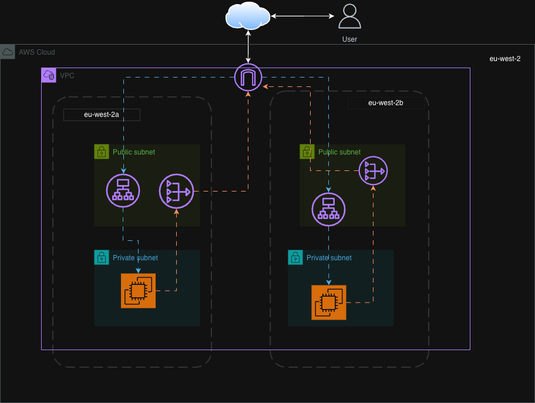
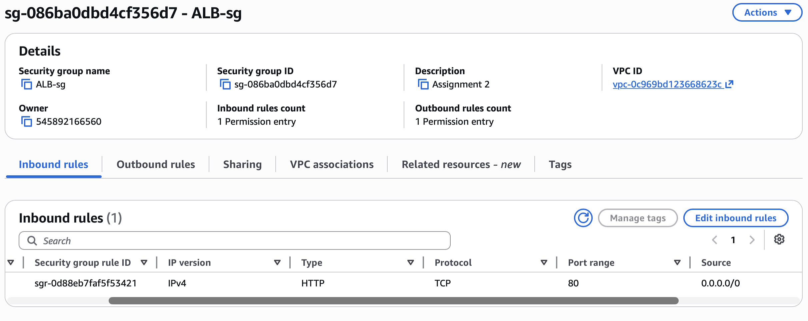
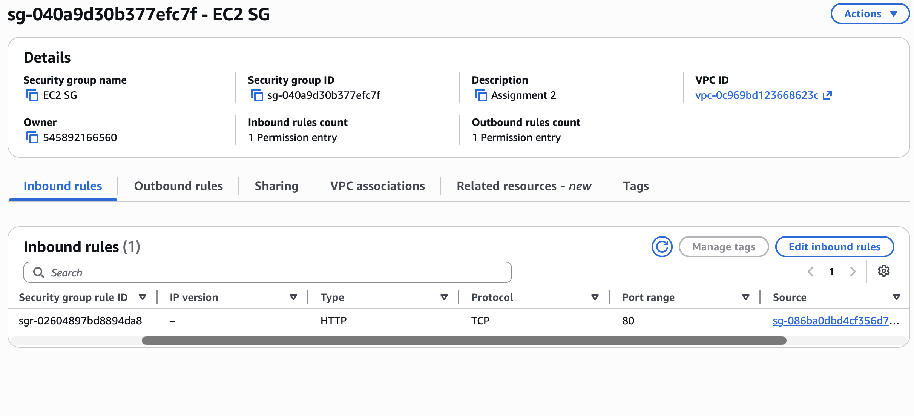
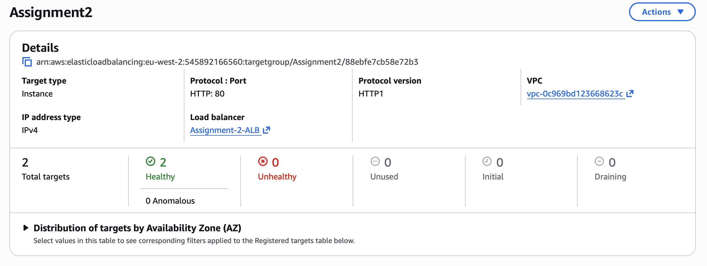

# Assignment 2 - Application Load Balancer

## Objective

Deploy two EC2 instances behind an Application Load Balancer (ALB).

The ALB handles incoming traffic while the EC2 instances remain private and inaccessible directly from the internet.

---

# Architecture

- 2 EC2 instances deployed across 2 Availability Zones
- EC2 instances placed in private subnets
- Application Load Balancer deployed in public subnets
- Apache web server installed using EC2 user-data
- ALB health checks configured on `/`
- Traffic distributed across both EC2 instances

---

# Architecture Diagram



---

# Services Used

- Amazon EC2
- Application Load Balancer (ALB)
- Target Groups
- Security Groups
- Amazon VPC

---

# EC2 Configuration

Two EC2 instances were launched in private subnets across different Availability Zones.

User-data was used to automatically:

- Update the instance
- Install Apache (`httpd`)
- Start the Apache web server
- Enable Apache on boot
- Create a unique `index.html` page for load balancing tests

---

# User-Data Script

```bash
#!/bin/bash
dnf update -y
dnf install -y httpd
systemctl start httpd
systemctl enable httpd
echo "Hello from Web Server 1" > /var/www/html/index.html
```

---

# Load Balancer Configuration

## Application Load Balancer

- Internet-facing ALB
- Listener configured on HTTP port 80
- Deployed across two public subnets

## Target Group

- Target type: Instances
- Protocol: HTTP
- Port: 80
- Health check path: `/`

Both EC2 instances were registered successfully and passed health checks.

---

# Security Groups

## ALB Security Group

| Type | Port | Source |
|------|------|------|
| HTTP | 80 | 0.0.0.0/0 |

### Screenshot



---

## EC2 Security Group

| Type | Port | Source |
|------|------|------|
| HTTP | 80 | ALB Security Group |

This configuration prevents direct public access to the EC2 instances.

### Screenshot



---

# Health Checks

The ALB health checks were configured on the root path:

```text
/
```

Both EC2 instances reported a healthy status.

### Screenshot



---

# Testing Load Balancing

The ALB DNS name was used to test traffic distribution across both EC2 instances.

Refreshing the browser alternated traffic between:

- Web Server 1
- Web Server 2

This confirmed successful load balancing.

---

## Load Balancer Test - Web Server 1


---

## Load Balancer Test - Web Server 2


---

# Outcome

Successfully deployed a highly available web application architecture using:

- Private EC2 instances
- Application Load Balancer
- Target Groups
- Health Checks
- Security Group isolation
- Automated server provisioning with EC2 user-data