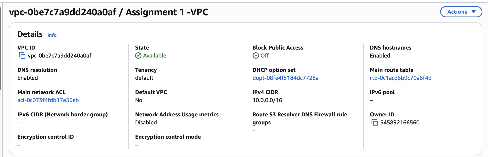
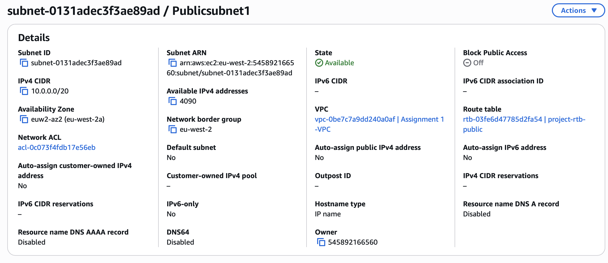
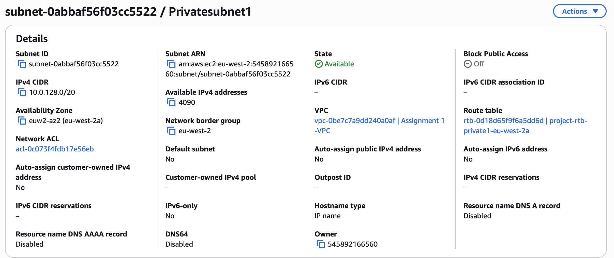
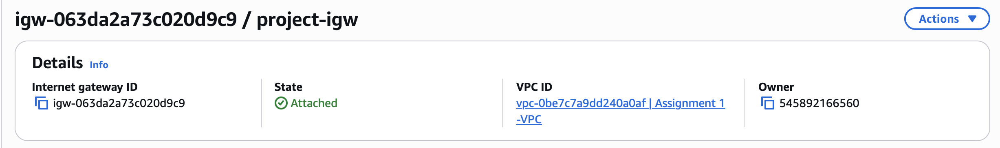
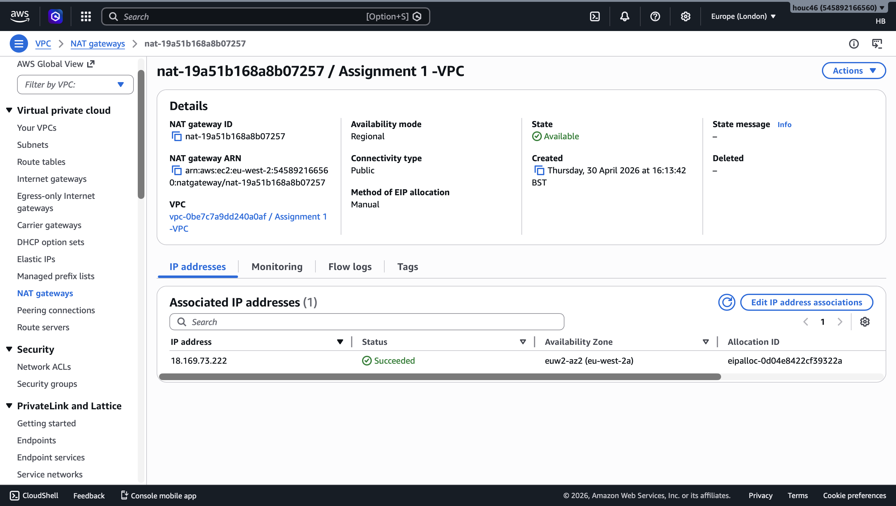
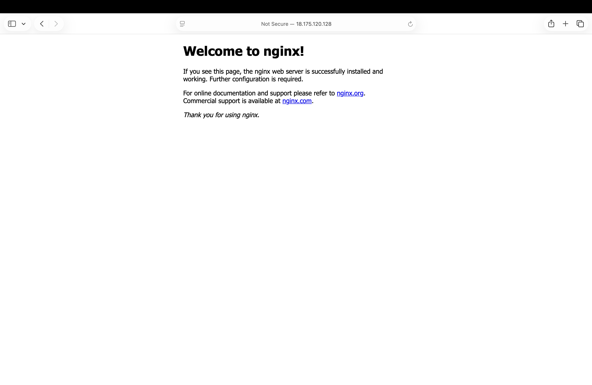

# AWS Assignment 1 – VPC & Networking

## Overview

This project demonstrates building a custom AWS network from scratch using a VPC with public and private subnets, secure routing, and EC2 instances.

---

## Architecture

* **VPC:** 10.0.0.0/16
* **Public Subnet:** Internet-facing resources
* **Private Subnet:** Internal resources only

### Components:

* Internet Gateway (IGW)
* NAT Gateway (with Elastic IP)
* Public EC2 (Nginx)
* Private EC2 (no public access)

---

## Architecture Diagram

---

## Steps Implemented

### 1. VPC

* Created custom VPC with DNS enabled

📸

### 2. Subnets

* Public Subnet
* Private Subnet

📸 Public Subnet

📸 Private Subnet

### 3. Internet Gateway

* Attached to VPC for public internet access

📸

### 4. NAT Gateway

* Deployed in public subnet
* Enables outbound internet for private subnet

📸

### 5. Route Tables

* Public → IGW
* Private → NAT Gateway

### 6. EC2 Instances

#### Public EC2

* Has public IP
* Running Nginx

📸

#### Private EC2

* No public IP
* Access via SSH from public EC2

---

## Security

* Public EC2:

  * SSH (22) → My IP
  * HTTP (80) → My IP

* Private EC2:

  * SSH only from public EC2

---

## Traffic Flow

Internet → IGW → Public EC2
Public EC2 → Private EC2 (SSH)
Private EC2 → NAT Gateway → Internet

---

## What I Learned

* VPC networking fundamentals
* Public vs Private subnet design
* Secure architecture patterns
* NAT Gateway usage

---

## Tools Used

* AWS VPC
* EC2
* NAT Gateway
* Internet Gateway
* Nginx

